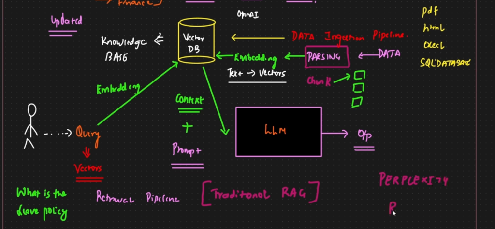
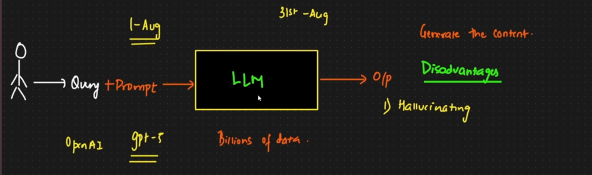

This project demonstrates a Retrieval-Augmented Generation (RAG) pipeline for processing PDF documents, creating embeddings, and querying a knowledge base to augment LLM responses.

## Architecture

### RAG Pipeline Flow


The core mechanism of this project follows the RAG architecture shown above:
1. **Data Ingestion**: PDF documents and other data sources are loaded.
2. **Parsing & Chunking**: The text involves parsing the raw data and splitting it into manageable chunks.
3. **Embedding**: Text chunks are converted into vector embeddings.
4. **Vector Database**: These embeddings are stored in a Vector Database (like ChromaDB or FAISS) for efficient similarity search.
5. **Retrieval**: When a user asks a question, the system queries the Vector DB to find the most relevant context.
6. **Generation**: The retrieved context + the user's prompt are sent to the LLM to generate an accurate, grounded response.

### LLM in Workspace


This diagram helps visualize how the Large Language Model (LLM) fits within the broader workspace and application logic, illustrating the limitations of a standalone LLM (limitations in knowledge cutoff, hallucinations) and how integrating it with external data sources (like in this workspace) enhances its capabilities.

## Project Structure

- `notebook/`: Contains Jupyter notebooks for the RAG implementation (e.g., `pdf_loader.ipynb`).
- `data/`: Directory for storing raw PDF documents and persisted vector stores.
- `src/`: Source code modules.
- `requirements.txt`: Python dependencies.
- `.env`: Configuration file for API keys (e.g., OpenAI API Key).

## Setup & Installation

1. **Clone the repository** (if you haven't already):
    ```bash
    git clone https://github.com/krishnaik06/RAG-Tutorials.git
    cd RAG-Tutorials
    ```

2. **Create and activate a virtual environment**:
    ```bash
    python -m venv .venv
    source .venv/bin/activate  # On Mac/Linux
    # .venv\Scripts\activate   # On Windows
    ```

3. **Install dependencies**:
    ```bash
    pip install -r requirements.txt
    ```

4. **Environment Configuration**:
    Create a `.env` file in the root directory and add your keys:
    ```
    OPENAI_API_KEY=your_api_key_here
    ```

## Usage

You can explore the RAG implementation by running the provided notebooks:

```bash
jupyter notebook notebook/pdf_loader.ipynb
```
Follow the steps in the notebook to load PDFs, create the vector store, and ask questions.

## Contributing

1. Fork the repository.
2. Create your feature branch (`git checkout -b feature/AmazingFeature`).
3. Commit your changes (`git commit -m 'Add some AmazingFeature'`).
4. Push to the branch (`git push origin feature/AmazingFeature`).
5. Open a Pull Request.
